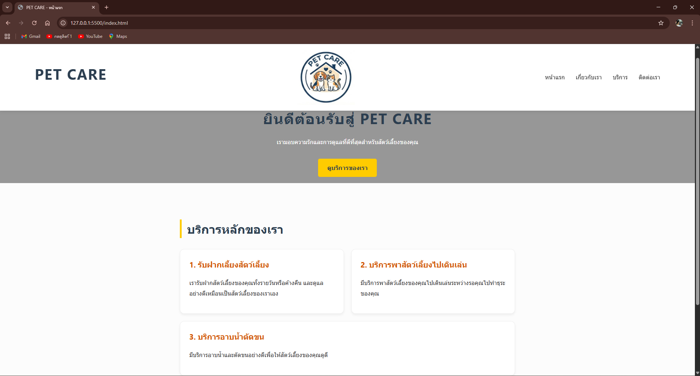
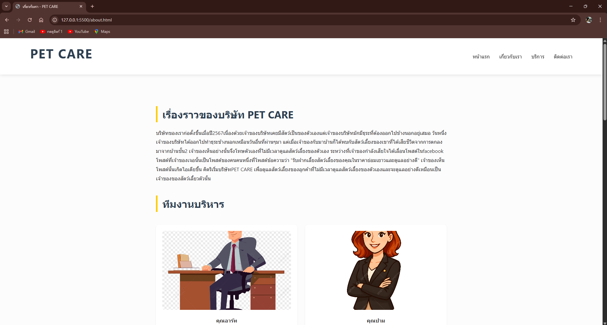
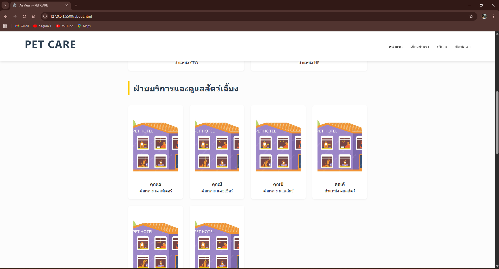
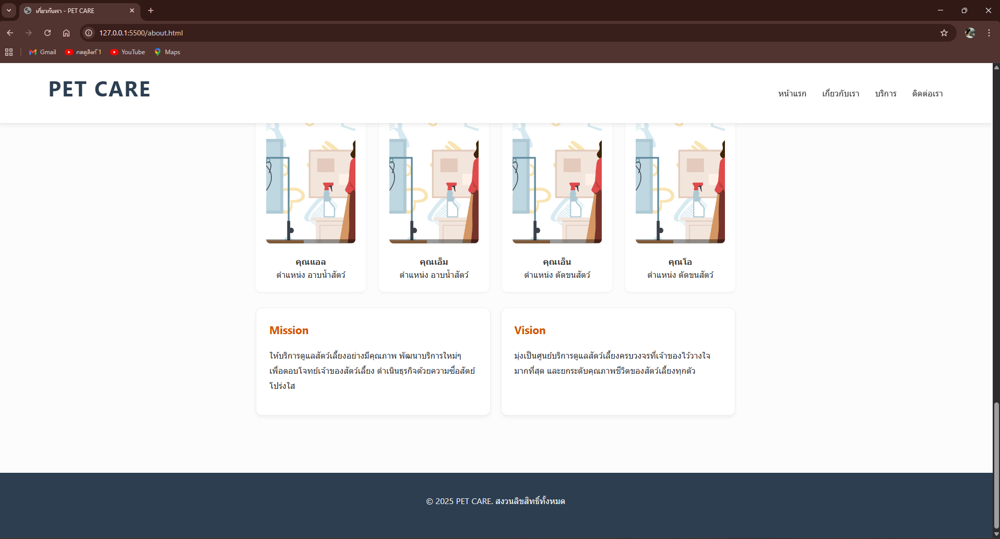
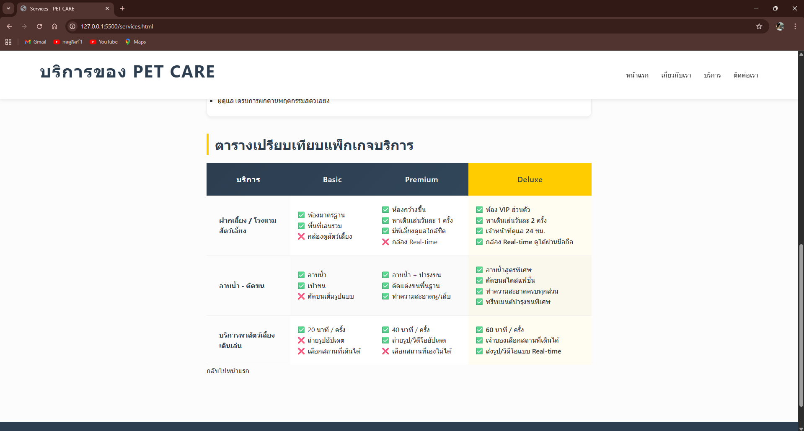
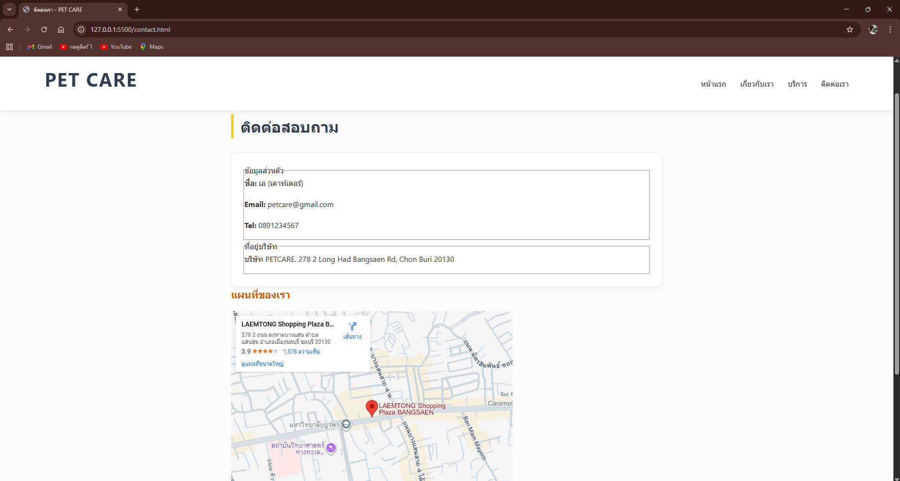

# PETCARE 
เว็บไซต์จำลองของ **PETCARE ** สำหรับ **Assignment #2**  
เป็นเว็บไซต์บริษัทPETCARE บริษัทรับฝากดูแลสัตว์เลี้ยง
เรามอบความรักและการดูแลที่ดีที่สุดสำหรับสัตว์เลี้ยงของคุณ


## ลิงก์เข้าสู่หน้าต่างๆ:

[หน้าแรก](index.html)


[เกี่ยวกับเรา](about.html)





[บริการของเรา](services.html)



[ติดต่อเรา](contact.html)


```text
my-business-web/
├── index.html
├── about.html
├── services.html
├── contact.html
├── css/
│ └── styles.css
├── README.md
└── images/
    ├── logo.jpg
    ├── ...

```

## CSS Checklist
- [x] Universal Selector & Reset (`*`)
- [x] Element Selectors (`h1–h4`, `p`, `a`, `table`)
- [x] Class Selectors (`.hero`, `.card`, `.btn`)
- [x] ID Selectors (`#header`, `#footer`)
- [x] Pseudo-classes (`:hover`, `:nth-child`)
- [x] CSS Units (`px`, `rem`, `%`, `vh`)
- [x] Color Palette & Typography
- [x] Box Model (`padding`, `margin`, `border`)
- [x] Positioning (`sticky`, `fixed`)
- [x] Display & Layout (Flexbox, Grid Layout)
- [x] Hover Effects & Transitions
- [x] CSS Organization & Comments

---
## ผู้จัดทำ

ชื่อ-นามสกุล: ธนวัฒน์ สุนทรชัย
รหัสนิสิต: 67160011