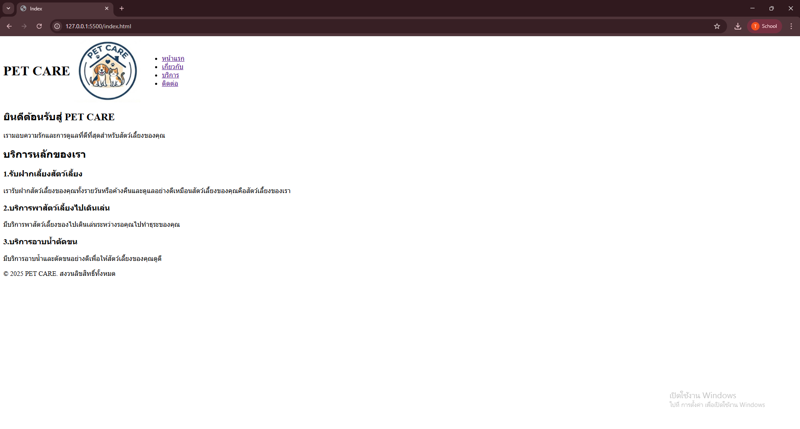
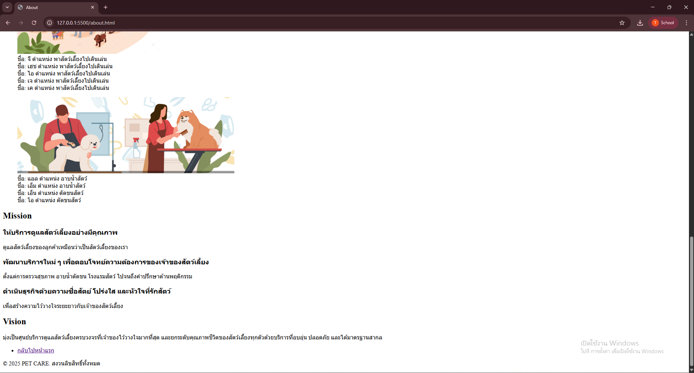
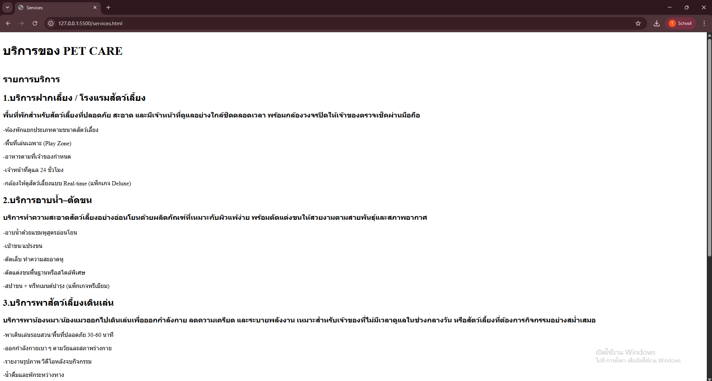
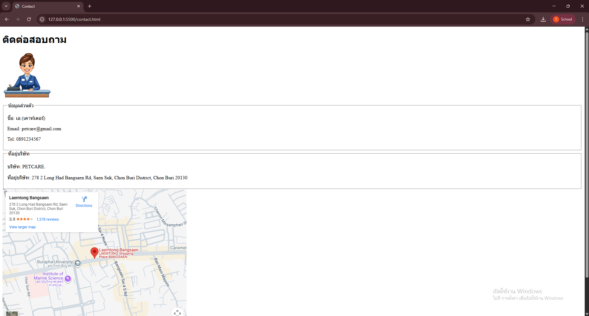

# PETCARE 
เว็บไซต์จำลองของ **PETCARE ** สำหรับ **Assignment #1**  
เป็นเว็บไซต์บริษัทPETCARE บริษัทรับฝากดูแลสัตว์เลี้ยง

## รายละเอียดข้อมูล
เว็บไซต์ประกอบด้วย **4 หน้าหลัก** ดังนี้ :

1. หน้าแรก (Home)
2. เกี่ยวกับเรา (About)
3. บริการ (Services)
4. ติดต่อเรา (Contact)

## โครงสร้างไฟล์

- index.html : หน้าแรก (Home)
- about.html : หน้าเกี่ยวกับเรา (About)
- services.html : หน้าบริการ (Services)
- contact.html : หน้าติดต่อเรา (Contact)
- images/ : โฟลเดอร์เก็บรูปภาพ
  - index.png
  - about1.png
  - about2.png
  - service1.png
  - service2.png
  - contact.png
- README.md : เอกสารประกอบโปรเจกต์

## ลิงก์เข้าสู่หน้าต่างๆ

### [หน้าแรก](index.html)



### [เกี่ยวกับเรา (About)](about.html)




### [บริการของเรา (Services)](services.html)




### [ติดต่อเรา (Contact)](contact.html)




```text
my-business-web/
├── index.html
├── about.html
├── services.html
├── contact.html
├── css/
│ └── styles.css
├── README.md
└── images/
    ├── logo.jpg
    ├── ...
```

## CSS Checklist

- [x] Universal Selector & Reset (`*`)
- [x] Element Selectors (`h1–h4`, `p`, `a`, `table`)
- [x] Class Selectors (`.hero`, `.card`, `.btn`)
- [x] ID Selectors (`#header`, `#footer`)
- [x] Pseudo-classes (`:hover`, `:nth-child`)
- [x] CSS Units (`px`, `rem`, `%`, `vh`)
- [x] Color Palette & Typography
- [x] Box Model (`padding`, `margin`, `border`)
- [x] Positioning (`sticky`, `fixed`)
- [x] Display & Layout (Flexbox, Grid Layout)
- [x] Hover Effects & Transitions
- [x] CSS Organization & Comments

---

## ลิงก์เข้าสู่หน้าต่างๆ:

[หน้าแรก](index.html)


[เกี่ยวกับเรา](about.html)


[บริการของเรา](services.html)


[ติดต่อเรา](contact.html)


## ผู้จัดทำ

ชื่อ-นามสกุล: ธนวัฒน์ สุนทรชัย
รหัสนิสิต: 67160011